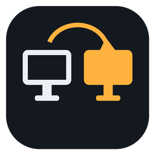
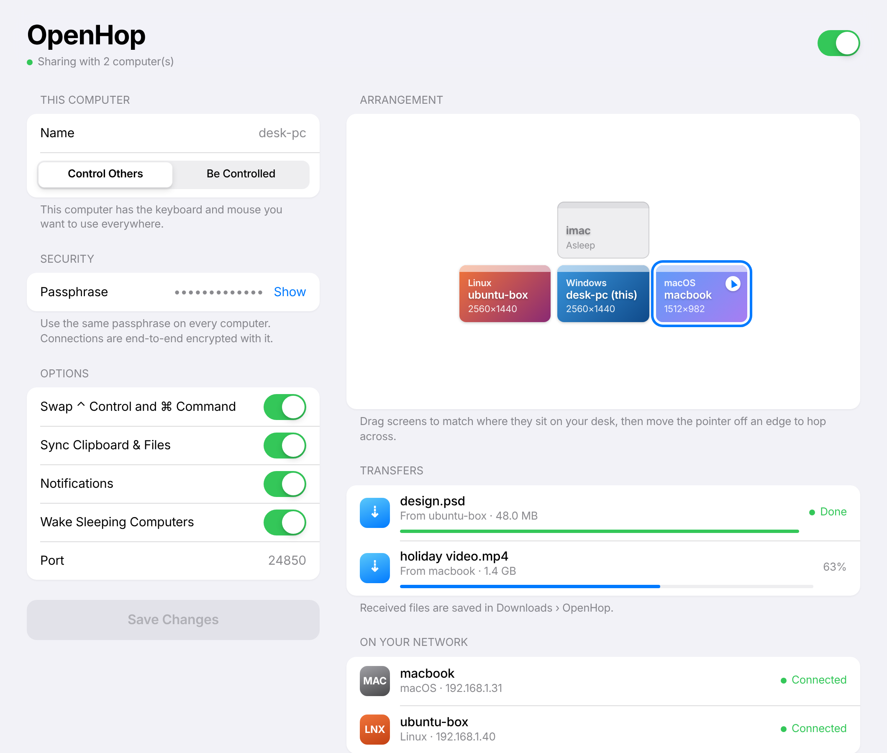
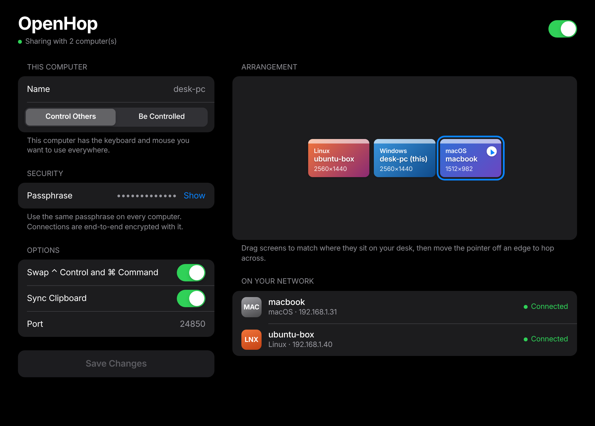
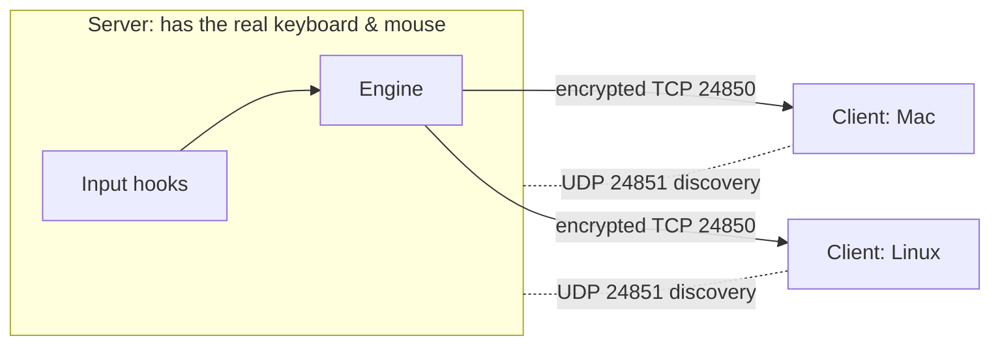
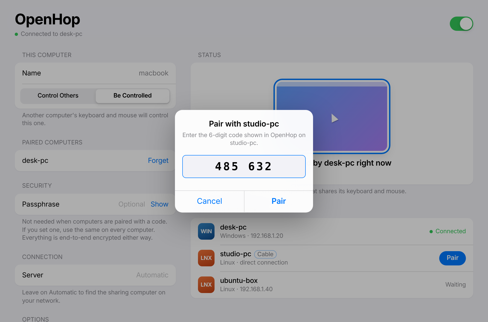
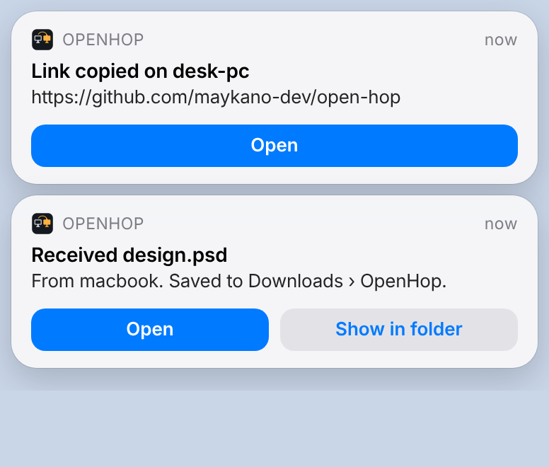
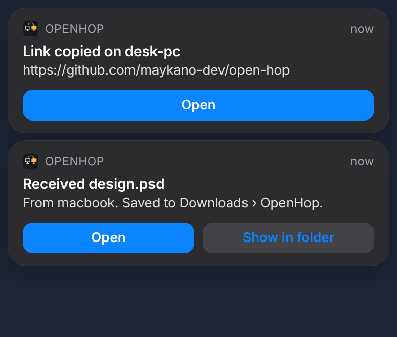
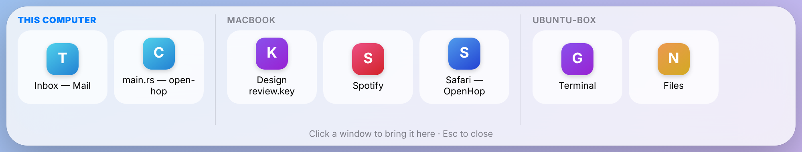

<div align="center">



# OpenHop

**One keyboard and mouse for all your computers.**
Free, open-source and encrypted. Works across Windows, macOS and Linux.

[](https://github.com/maykano-dev/open-hop/actions/workflows/build.yml)


</div>

<p align="center">
  
  
</p>

OpenHop is a **software KVM**. Put a few computers on your desk, run OpenHop on each of them, and move your mouse off the edge of one screen: the pointer appears on the next computer, and your keyboard follows it. Copy text, screenshots, files and videos on one machine and paste them on another, or drag files straight across the screen edge. You don't need a hardware switch or any extra cables, only your local network.

> **Updating?** Use **Check for Updates** in the app (v0.3+) or rerun the one-line installer. Keep **every computer on the same version**, because different protocol versions can't connect to each other. See [Updating](#updating).

It was built as a free, cross-platform alternative to paid tools such as CursorHop, Synergy or ShareMouse, with Linux supported as a first-class platform.

---

## Quick install

Run one command on each computer:

**Windows** (PowerShell):
```powershell
irm https://raw.githubusercontent.com/maykano-dev/open-hop/main/scripts/install.ps1 | iex
```

**macOS and Linux** (Terminal):
```bash
curl -fsSL https://raw.githubusercontent.com/maykano-dev/open-hop/main/scripts/install.sh | bash
```

The script downloads the latest release and installs it the native way for your system: the setup `.exe` on Windows, the `.dmg` app on macOS, and the `.deb` or `.rpm` package (or an AppImage) on Linux, including the input permissions Linux needs. If you'd rather click than type, download the installer directly:

| Your computer | Download from [Releases](https://github.com/maykano-dev/open-hop/releases/latest) |
|---|---|
| Windows 10 / 11 | `OpenHop_x.y.z_x64-setup.exe` (double-click to install) |
| macOS (Apple Silicon & Intel) | `OpenHop_x.y.z_universal.dmg` (drag to Applications) |
| Ubuntu / Debian / Mint | `OpenHop_x.y.z_amd64.deb` |
| Fedora / openSUSE | `OpenHop-x.y.z-1.x86_64.rpm` |
| Any other Linux | `OpenHop_x.y.z_amd64.AppImage` |

Then follow [Set up your computers](#set-up-your-computers).

## Contents

- [Quick install](#quick-install)
- [Features](#features)
- [How it works](#how-it-works)
- [Platform support](#platform-support)
- [Install](#install)
  - [Windows](#windows) · [macOS](#macos) · [Linux (Ubuntu, Debian, Fedora…)](#linux)
- [Set up your computers (5 minutes)](#set-up-your-computers)
  - [Connecting without a router](#connecting-without-a-router) · [Updating](#updating)
- [Everyday use](#everyday-use)
- [FAQ](#faq)
- [Command line](#command-line)
- [Configuration file](#configuration-file)
- [Security](#security)
- [Troubleshooting](#troubleshooting)
- [Build from source](#build-from-source)
- [Project layout](#project-layout)
- [Roadmap](#roadmap)
- [License](#license)

---

## Features

| | |
|---|---|
| 🖱 **Mouse sharing** | Move the pointer off a screen edge and it hops to the next computer. No hotkeys or buttons needed. |
| ⌨️ **Keyboard sharing** | Your keyboard types on whichever computer has the pointer. Held keys are released when you leave a screen, so nothing gets stuck. |
| ⌘ **Shortcut translation** | When you cross between a Mac and a PC, `⌘ Command` and `Ctrl` are swapped automatically, so ⌘C on your Mac keyboard becomes Ctrl+C on Windows or Linux. |
| 📋 **Clipboard sync** | Copy text, an image or a screenshot on one computer and paste it on another. Images arrive pixel-perfect. |
| 📁 **Copy & paste files** | Copy files, folders or videos in Explorer, Finder or Files, hop over, and paste: the real files arrive, not a path. A copied picture file pastes as a picture too, into chats, documents and image editors. |
| 🫳 **Drag & drop files across screens** | Drag files off one computer's screen and drop them into a folder or app on another's, just like a local drag. |
| 🏝 **The island** | Lives at the top of the screen and stays out of your way: on a MacBook it wraps around the notch, on other Macs it sits in the menu bar, and on Windows and Linux it gets a lane of its own across the top of the screen (maximized windows leave it free, so it never covers a tab), or, where the system can't keep a strip free, rests as a thin line that clicks pass through. Rest the pointer on it and it opens into the Control Center: music, Focus, Lock All, Sleep All, every computer's battery and storage, and their windows. Live pills show files flying with a progress ring, a song starting, a copy; notices pop out of it on the screen you're using. |
| 📱 **Phones, no app needed** | Scan the QR code in the island with an iPhone or Android phone and a page opens on it: send photos, videos, files and text to the computer, and pick up files you drop on **Phone** in the island. Same Wi‑Fi; the address has a random key only your phone gets. |
| 🏫 **Choose what's shared** | For schools, offices and shared computers: switch off being controlled, sharing this keyboard and mouse, or Focus, Lock All and Sleep All for this computer. Switched-off actions leave the island, and it shows what's off. |
| 🎵 **Media controls** | What's playing on any computer (Spotify, a video in the browser, a music app), with cover art, a progress bar, play/pause, skip and shuffle, from any computer. |
| 📤 **Send with OpenHop** | Right-click files in Explorer, Finder, Files, Dolphin, Nemo, Thunar or Caja and choose **Send with OpenHop** › a computer (or all of them, or the shelf). OpenHop doesn't need to be open. On Windows it's also in **Send to**; on a Mac it's a Quick Action. |
| 🗂 **Clipboard history** | Everything copied on any computer, searchable, in the island's **Clipboard** tab. Pick one to copy it again; pin the ones you want to keep. |
| 🧺 **Shelf** | Drop files on the island to keep them within reach of every computer, then take them from any of them. Or drop them on a computer's name to send them there. |
| 🚀 **Apps on every computer** | The island's **Open** tab works like a task manager for all your computers: the apps that are open (in the dock or taskbar), the ones running in the background with their memory use, and every installed app. Switch to one, quit one, or open one where it lives; the pointer goes there. |
| ⌨️ **Shortcuts** | Ctrl+Alt+Space opens the Control Center (then H, C, S, O switch tabs, P shows the phone code). Ctrl+Alt+Shift+arrows jump to the next screen; Ctrl+Alt+Shift+Space keeps the pointer where it is. No letter shortcuts, so nothing clashes with AltGr characters or other apps. |
| 🎮 **Game guard** | A full-screen game or video keeps the pointer on its screen. Corners never hop, and the pointer rests a moment at an edge first, so you don't hop by accident. |
| 🪟 **Windows from any computer** | The Control Center (**Ctrl+Alt+Space**, or hover the island) shows the open windows of every computer. Click one and it opens live on the computer you're using, with its own title bar: you see it update and can click, scroll and type in it. Or just drag a window by its title bar off the screen edge, and drag it back the same way. |
| 🌙 **Dark mode sync** | Switch dark mode on one computer and the others follow. |
| 🔕 **Focus everywhere** | Turn on Focus (Do Not Disturb) from the island, the tray or any computer's own settings, and every computer goes quiet. |
| ✨ **Landing animation** | A short animation where files or windows arrive. |
| 🎨 **Looks right** | Light or dark following your computer's own setting, with six accent colours. |
| 🔁 **Connect once** | Turn OpenHop on once and it stays on: with its window closed, after restarts and after the computer is switched off and on, until you switch it off. |
| 🔗 **Smart link prompts** | Copy a link on one computer, move to another, and a notification offers to open it there in the default browser. |
| 💤 **Wake-on-LAN** | Move the pointer toward a computer that's asleep and OpenHop sends it a wake-up packet. |
| 🔒 **End-to-end encryption** | Every keystroke, mouse movement and clipboard item is encrypted with the [Noise protocol](https://noiseprotocol.org) (X25519, ChaCha20-Poly1305, BLAKE2s). There is no plaintext mode. |
| 📡 **Zero-config discovery** | Computers on the same network find each other automatically. You don't type any IP addresses. |
| 🤝 **AirDrop-style pairing** | Pick the computer from a list and type the 6-digit code it shows. No passwords to agree on, and it reconnects by itself from then on. |
| 🔌 **No router needed** | Join two computers with an Ethernet, USB-C or Thunderbolt cable and they connect directly, while each keeps its own Wi-Fi. |
| 🐢 **Bandwidth friendly** | Mouse and keyboard use under 0.1 Mbps. Big file transfers can be capped with **Speed Limit** so they never hog your Wi-Fi. |
| ⬆️ **One-click updates** | **Check for Updates** downloads and installs the new version for you. |
| 🗺 **Drag-and-drop arrangement** | Arrange screens the way they sit on your desk: left, right, above, below, or chained (A → B → C). Or choose **Arrange by moving the mouse** and push the pointer toward each computer. |
| 🖥 **Multi-monitor aware** | Each computer's full desktop (all of its monitors) counts as one screen. |
| 🌗 **Native-feeling app** | An Apple-inspired settings window and iOS-style notifications, in light and dark mode. It keeps running in the system tray. |
| 🛟 **Resilient connections** | Mouse and keyboard travel on a priority lane that never waits behind a file transfer, and a computer that sleeps or drops off Wi-Fi is detected and reconnected automatically. |
| 🦀 **Fast Rust core** | Native input hooks and a lean protocol. A mouse move costs about 10 bytes on the wire. |
| 💻 **Headless CLI** | Run it on machines without a desktop session, or script it. |

## How it works

Every computer can use every screen with its own keyboard and mouse: move any computer's pointer off a screen edge and it carries on onto the next screen, with that computer's keyboard. Behind the scenes one computer keeps the group together (the **hub**: the one the others paired with) and passes input along; you never have to choose which.



1. Every computer watches its own pointer. When it touches an edge that has a screen next to it in your arrangement, that computer **captures** its keyboard and mouse. Its pointer is hidden and parked, and its keystrokes and clicks stop reaching local apps.
2. Mouse motion, clicks, scrolling and key presses go (through the hub) to the computer whose screen the pointer is on, which **injects** them as if they came from a real device.
3. When the pointer leaves that screen, it lands on the next screen in the arrangement, or back home, where the keyboard and mouse work directly again.
4. There's only ever one pointer: a screen the pointer has left hides its own pointer until its own mouse or touchpad moves (then it can hop across too).
5. Keys travel as standard USB HID codes, so a key pressed on any OS arrives as the same physical key on every other OS.
6. Files and live window pictures travel on a separate bulk lane in small pieces, and each connection keeps only a short queue of unsent data, so keys and clicks never wait behind them.

## Platform support

| | Use its keyboard & mouse on other screens | Its screen used by other computers |
|---|:---:|:---:|
| **Windows 10 / 11** | ✅ | ✅ |
| **macOS 11+** (Apple Silicon & Intel) | ✅ needs Accessibility permission | ✅ needs Accessibility permission |
| **Linux, X11 / Xorg session** | ✅ | ✅ |
| **Linux, Wayland session** (default on Ubuntu 22.04+) | ⚠️ not yet, see [roadmap](#roadmap) | ✅ via `uinput` (set up automatically by the .deb) |

**What works on Wayland.** Other computers can use a Wayland desktop's screen, but its own keyboard and mouse can't hop to them yet. For that, log in with an Xorg session.

**Drag & drop.** Dragging *from* a computer works from Windows Explorer, macOS Finder and Linux file managers (on Ubuntu's default Wayland session, OpenHop briefly puts a tiny helper window under the pointer to see the drag). Dropping lands the files in the folder or app under the pointer on Linux (X11 apps) and Windows. On macOS, and anywhere a drop isn't accepted, the files are saved to `Downloads/OpenHop` and put on the clipboard, so you can paste them where you want them.

**Live windows and the other v0.4 extras.**

| | Windows | macOS | Linux X11 | Linux Wayland |
|---|:---:|:---:|:---:|:---:|
| Live windows (share its windows) | ✅ | ✅ needs **Screen Recording** permission | ✅ | ⚠️ only apps running under XWayland |
| Live windows (view and control) | ✅ | ✅ | ✅ | ✅ |
| Dark mode sync | ✅ | ✅ (asks to control System Events once) | ✅ GNOME | ✅ GNOME |
| Do Not Disturb sync | best effort | via two Shortcuts* | ✅ GNOME | ✅ GNOME |

\* macOS has no public switch for Focus. In the Shortcuts app, make two shortcuts named **OpenHop Focus On** and **OpenHop Focus Off**, each with one *Set Focus* action, and OpenHop runs them.

> **Test status (v0.9.0).** Tested on Linux with two copies of the app: the island resting as a click-through line and opening when the pointer rests on it, media controls from the other computer (play/pause, next) with a test player, the task list for both computers, quitting an app on the other computer, a broken app reporting why it didn't open on the screen in use, the clipboard history's copy pill. The media controls on Windows and macOS, the notch layout and quitting apps there build in CI but haven't been tried on real machines.

> **Test status (v0.7.0).** Tested on Linux with two copies of the app: the island at rest, opening on hover, Focus switching on both computers, the pin and jump shortcuts (also while the keyboard was in use on the other screen), notices in the island, quick edge touches and corners not hopping while resting at the edge does. Battery warnings, Lock All and Sleep All use each system's own tools and weren't exercised here (no battery or login session in the test setup). Windows and macOS build in CI but haven't been tried on real machines.

> **Test status (v0.6.0).** Tested end to end on Linux (two X servers, two copies of the app, and the app with the command-line version): a laptop's own mouse and keyboard driving the desktop and coming home, the desktop's mouse taking over again, the touchpad moving the pointer while the desktop's mouse was on the laptop, pairing by tapping and typing the code (the computer that types the code joins), forgetting (it stands alone again), rearranging screens from the joined computer, maximizing and restoring a live window, clicking in it while maximized, and dragging it back home. Windows and macOS build and pass the automated tests but haven't been tried on real machines.

> **Test status (v0.5.0).** Tested end to end on Linux (two X servers, the app on one side and the command-line version on the other, both ways round): clicking and fast typing into a live window of the computer sharing its keyboard and mouse, moving a live window by its own title bar, dragging it back home (it keeps following the mouse) and from the other side, the on/off state surviving a restart, and taking over the port from an older copy. Windows and macOS build and pass the automated tests but haven't been tried on real machines.

> **Test status (v0.4.0).** The v0.4 features were tested end to end on Linux: the window dock, opening a live window, clicking and typing into it from both computers' keyboards, dragging a window by its title bar onto another computer, dark mode and Do Not Disturb sync in both directions, and the arrival animation. The Windows and macOS versions build and pass the automated tests, but haven't been tried on real machines yet.

> **Test status (v0.2.0).** On Linux, everything is tested end to end: edge switching, typing and clicks, the stuck-switching fix (hopping keeps working while another computer is frozen), stale-connection replacement, text, image and full-screenshot clipboard, copy & paste of a 300 MB video, folders, and client-to-client files, drag & drop in both directions, Wake-on-LAN, notifications and their buttons, and the one-line installer. The Windows and macOS code compiles cleanly and CI builds their installers, but it hasn't yet had hands-on testing on real hardware. Please [open an issue](https://github.com/maykano-dev/open-hop/issues) if something misbehaves.

---

## Install

The easiest way is the [one-line installer](#quick-install). To install by hand, download the installer for each computer from the repository's
**[Releases](https://github.com/maykano-dev/open-hop/releases)** page. Every push to `main` also builds installers: open the latest run under **[Actions → Build](https://github.com/maykano-dev/open-hop/actions/workflows/build.yml)** and download the `OpenHop-Windows`, `OpenHop-macOS` or `OpenHop-Linux` artifact.

### Windows

1. Run **`OpenHop_x.y.z_x64-setup.exe`** (or the `.msi`).
2. Windows SmartScreen may warn about an unrecognised app, because the builds aren't code-signed. Click **More info → Run anyway**.
3. When Windows Firewall asks, allow OpenHop on **Private networks**.
4. OpenHop opens and adds an icon to the system tray. Closing the window keeps it running; quit from the tray icon.

> To control windows that run **as Administrator** (Task Manager, installers), OpenHop must also run as Administrator. That's a Windows security rule that applies to every KVM app.

### macOS

1. Open **`OpenHop_x.y.z_universal.dmg`** and drag **OpenHop** into **Applications**.
2. The app isn't notarised yet, so open it the first time by right-clicking it and choosing **Open**, then **Open** again. If macOS says it is "damaged", run this once in Terminal:
   ```bash
   xattr -cr /Applications/OpenHop.app
   ```
3. **Grant permissions.** OpenHop needs to read and control the keyboard and mouse:
   - **System Settings → Privacy & Security → Accessibility** → turn on **OpenHop**
   - **System Settings → Privacy & Security → Input Monitoring** → turn on **OpenHop** (needed when the Mac shares its keyboard and mouse)
4. Quit and reopen OpenHop after granting them.
5. If macOS asks whether OpenHop may find devices on your local network, click **Allow**.

### Linux

**Ubuntu / Debian / Mint / Pop!_OS** (recommended):

```bash
sudo apt install ./OpenHop_0.1.0_amd64.deb
```

The package installs a udev rule and loads the `uinput` kernel module, so OpenHop can control your desktop on both X11 and Wayland. **Log out and back in once** after installing.

**Other distributions (AppImage):**

```bash
chmod +x OpenHop_0.1.0_amd64.AppImage
./OpenHop_0.1.0_amd64.AppImage
```

On Wayland, to be controlled from another computer, enable `uinput` once:

```bash
sudo modprobe uinput
echo uinput | sudo tee /etc/modules-load.d/openhop-uinput.conf
echo 'KERNEL=="uinput", SUBSYSTEM=="misc", GROUP="input", MODE="0660", OPTIONS+="static_node=uinput", TAG+="uaccess"' \
  | sudo tee /etc/udev/rules.d/60-openhop-uinput.rules
sudo udevadm control --reload-rules && sudo udevadm trigger --name-match=uinput
sudo usermod -aG input "$USER"    # then log out and back in
```

**Firewall** (if `ufw` is enabled):

```bash
sudo ufw allow 24850/tcp && sudo ufw allow 24851/udp
```

---

## Set up your computers

It works like AirDrop: no accounts, no IP addresses, no passwords to agree on.

**1. Install OpenHop on every computer** (see [Quick install](#quick-install)). Open it and leave it running in the tray.

**2. On one computer**, look under **Add a Computer**: it shows a 6-digit **Pairing Code**.

**3. On each of the other computers**, that computer pops up in the **Nearby** radar on the right, like Xender or AirDrop. Tap it (**Tap to connect**), type its code, and you're connected. From then on they reconnect automatically, even after restarts. There's no "control" or "be controlled": each computer's keyboard and mouse work on all the screens.

> **Host not showing up?** Click **Don't see it? Connect by address** under the radar and type the address shown on the host under **Add a Computer › Address** (for example `192.168.1.20` or `192.168.1.20:24852`), plus the code. This works even when your network or firewall blocks discovery.

<p align="center">
  
</p>

**4. Arrange your screens.** Back on the first computer, every connected computer appears under **Arrangement**. Drag each tile to where that computer sits on your desk, for example the MacBook to the right and the Ubuntu box to the left. The arrangement saves automatically.

**5. Hop!** Move your pointer off the edge of your screen toward another computer. A blue ring in the app shows which computer has the cursor.

> **Prefer a shared passphrase?** That still works. Type the same **Passphrase** on every computer and they'll connect without pairing. You might want this for scripted setups or a large office.

### Connecting without a router

The computers don't need to be on the same Wi-Fi.

- **A cable between them (recommended).** Connect two computers with an Ethernet cable, a USB-C/Thunderbolt cable (Thunderbolt Bridge on Macs), or a USB Ethernet adapter. OpenHop finds the other computer over the cable automatically: it shows up with a **Cable** badge. Each computer keeps its own Wi-Fi or internet connection; OpenHop's traffic simply uses the cable. This uses link-local addressing, which every OS sets up by itself with no configuration.
- **A phone hotspot.** Join both computers to the same hotspot.
- **Bluetooth networking (PAN).** Pair the computers in your OS's Bluetooth settings and join a Bluetooth network between them. OpenHop treats it like any other network. It's slower than Wi-Fi but fine for mouse and keyboard.

A built-in Bluetooth or Wi-Fi Direct link inside the app is on the [roadmap](#roadmap).

### Updating

- **OpenHop 0.3 and later:** the app checks for updates by itself and shows a notification when a new version is out. You can also open **Software Update › Check for Updates**, then click **Update**. It downloads the right installer, installs it and reopens. On Linux you'll be asked for your password.
- **Any version:** run the same [one-line install command](#quick-install) again. It installs the latest version over the old one and keeps your settings and pairings.

Update **every computer** to the same version: computers only connect to others running the same protocol version.

---

## Everyday use

- **Moving between computers:** push the pointer through a shared edge. The entry point keeps the same relative height (or width), so going in halfway down comes out halfway down.
- **Keyboard:** typing always goes to the computer under the pointer.
- **Shortcuts across Mac ↔ PC:** with **Swap ⌃ Control and ⌘ Command** on (the default), use your keyboard's usual shortcut keys and they get translated for the target OS.
- **Copy & paste:** copy as usual on one computer, move over, and paste.
  - ✅ **Text**, including whole documents of up to 8 MB.
  - ✅ **Screenshots and images**: a screenshot taken to the clipboard (`Win+Shift+S`, `⌘⇧⌃4`, `PrtSc` on Linux) or an image copied from a browser or photo app. A full 2560×1440 screenshot arrives in about a second.
  - ✅ **Files, folders and videos**: copy them in Explorer, Finder or your Linux file manager, move to the other computer, and paste into any folder, chat or upload box. A copied **picture file** (JPG, PNG, GIF, WebP, BMP, TIFF) also pastes as the picture itself into documents, chats and image editors. Small copies (under 64 MB) are sent right away. Bigger ones start as soon as your pointer arrives on that computer, so a 4 GB video isn't sent to every machine. Progress shows under **Transfers**, and a notification says when it's ready to paste. Received files also stay in `Downloads/OpenHop`.
- **Drag & drop files:** start dragging files in your file manager, carry them across the screen edge, and let go over a folder or app on the other computer. The files are dropped right there, with their own names. If nothing there accepts a drop (or on macOS), they're saved to `Downloads/OpenHop` and put on the clipboard, so you can paste them where you want them. The drag on the original computer is cancelled, so nothing moves or gets deleted there.
<p align="center">
  
  
</p>

- **Send with OpenHop:** select files or folders in your file manager, right-click, and choose **Send with OpenHop** › the computer's name (**All Computers** sends to every one, **Put on the Shelf** keeps them on the shelf). On Windows 11 it's under **Show more options**, and also in **Send to**; on a Mac, under **Quick Actions** (or **Services**). The menu lists every computer OpenHop has seen and updates itself. Files arrive in `Downloads/OpenHop`. On Linux the menu is added for Files (Nautilus), Dolphin, Nemo, Thunar and Caja.
- **Clipboard history:** open the island's **Clipboard** tab (or press C with the island open, or choose **Clipboard History** in the tray) to see what was copied on every computer. Type to search, use the arrow keys and Enter (or click) to copy one again, pin one to keep it.
- **Shelf:** drag files onto the island. While you drag it opens: let go over a computer's name to send them there, or anywhere else to put them on the shelf. The shelf (in the island) lists what's on every computer's shelf; click one from another computer and it's copied here, onto the clipboard, ready to paste.
- **Apps on every computer:** the island's **Open** tab (or O with the island open) lists, for every computer, the apps that are **open**, those running **in the background** (with how much memory they use), and **all apps**. Click an open app to switch to it, ✕ then **Quit** to close it (it can still ask to save; if it won't close, **Force Quit** appears). Type to search and press Enter to open an app; on another computer it opens there and the pointer moves to it. If an app doesn't start, the island says so and why. Clicking another computer's card in the **Home** tab moves the pointer there too.
- **Music and videos:** the island's **Home** tab shows what's playing, with play/pause, previous, next, shuffle and a progress bar you can click to jump. When several computers play, tap the app name to switch between them. On a Mac, Spotify and Music can be controlled (macOS keeps other apps' media to itself); the first time, macOS asks to let OpenHop control them.
- **Links:** copy a web link on one computer. When you move to another, a notification offers to open it there.
- **Waking a sleeping computer:** pushing the pointer toward a computer that's asleep sends it a Wake-on-LAN packet. Its tile shows **Asleep** in the arrangement. Wake-on-LAN must be enabled on that computer: in the BIOS/UEFI and network adapter settings on PCs, or with **Wake for network access** on Macs (works when plugged in). It works best over Ethernet.
- **Connect once:** you don't need to keep the window open, or open OpenHop again after a restart. Closing the window hides OpenHop to the tray or menu bar and sharing carries on, and it starts by itself (in the background, already connected) every time you sign in. It stays that way until you switch it off with the switch at the top of its window (or **Turn OpenHop Off** in the tray menu).
- **Nothing to set up:** clipboard and file sync, ⌃/⌘ swapping, dragging windows across screens, dark mode and Do Not Disturb sync, notifications and Wake-on-LAN are simply always on. The network port is chosen automatically: if an older OpenHop still holds it, that copy is closed; if another program has it, OpenHop uses the next free one. The only option is the transfer **Speed Limit**; the **Look** tab has the accent colour.
- **Windows from other computers:** press **Ctrl+Alt+Space** or hover the island at the top of the screen; the Control Center lists your other computers' windows. Click a window from any computer and it moves here: it looks and behaves like a normal window, with its own title bar (drag it to move it, click its buttons, drag an edge to resize it and the real one follows), while the app keeps running on its own computer, where the original is hidden until it comes back (macOS can't hide another app's window, so there it stays visible). You can also grab a window by its title bar and drag it off the screen edge onto another computer: it opens there under your pointer. Drag it by its title bar back across the edge and it's home again, still following your mouse.
- **Something feels stuck?** Move the pointer back to its own screen. Leaving a screen always releases every key and mouse button that was held there. If a computer stops responding (asleep, Wi-Fi dropped), OpenHop drops it within about 10 seconds, returns the pointer to you, and reconnects it automatically when it's back, in the same spot in your arrangement.

---

## FAQ

**Can I drag an app window from one computer onto another?**
Yes. Drag it by its title bar off the screen edge and it opens live on the other computer. A Windows app can't really run on a Mac (or the other way round), so the window keeps running where it is and you get a live view of it that you can click and type into, like Windows' *RemoteApp*. Only the parts of a window that change are sent, so typing and clicking use very little bandwidth; video playing in a window uses a few Mbps. Drag it back across the edge to bring it home.

**Do I have to keep OpenHop open on every computer?**
No. Turn it on once: it keeps working with its window closed, starts by itself when you sign in (even after the computer was switched off), and reconnects on its own. It only stops when you switch it off in its window or tray menu.

<p align="center">
  
</p>

**Will it slow down my Wi-Fi?**
Mouse and keyboard traffic is tiny, under 0.1 Mbps even while you move the mouse constantly. Only copying big files or images uses real bandwidth. To cap that, choose a **Speed Limit** under Options (for example 20 Mbps). Your pointer stays smooth during transfers either way, because input always goes first.

**Do I need a router or the same Wi-Fi?**
No. A cable between the two computers works with zero setup, and each keeps its own internet connection. A phone hotspot or Bluetooth networking also work. See [Connecting without a router](#connecting-without-a-router).

**What happens if a computer goes to sleep or drops off Wi-Fi?**
OpenHop notices within about 10 seconds and gives you the pointer back. The computer reconnects by itself when it's back, in the same place in your arrangement. With **Wake Sleeping Computers** on, moving toward it tries to wake it.

**Is it safe on public or office networks?**
Everything is end-to-end encrypted, and a computer must be paired (or know the passphrase) to connect. See [Security](#security).

## Command line

The `openhop` command-line tool runs the same engine without a window. It's useful for servers, scripting or troubleshooting.

```bash
# On the computer with the keyboard and mouse (prints its pairing code)
openhop server --name desk-pc

# On each controlled computer: pair once with the code, then just `openhop client`
openhop client --pair 485632 --name macbook
openhop client                       # reconnects with the saved pairing
openhop paired                       # list paired computers
openhop paired --forget macbook      # unpair

# Or use a shared passphrase instead of pairing
openhop server --passphrase "purple-river-lamp-42"
openhop client --passphrase "purple-river-lamp-42"

# ...or connect to a known address (IPv4, IPv6 or hostname)
openhop client --server 192.168.1.20

# Arrange screens: the server is at 0,0. 1,0 = right, -1,0 = left, 0,-1 = above, 0,1 = below
openhop place macbook 1 0
openhop place ubuntu-box -1 0

# See which OpenHop computers are around (network or direct cable)
openhop devices

# Show the config file location and contents (passphrase hidden)
openhop config
```

Add `--save` to any run command to store the given options in the config file. Set `RUST_LOG=debug` for detailed logs.

## Configuration file

Settings live in a TOML file, shared by the app and the CLI:

| OS | Location |
|---|---|
| Windows | `%APPDATA%\openhop\config.toml` |
| macOS | `~/Library/Application Support/openhop/config.toml` |
| Linux | `~/.config/openhop/config.toml` |

```toml
name = "desk-pc"             # name shown to other computers
role = "server"              # "server" or "client"
passphrase = "purple-river-lamp-42"
port = 24850                 # server TCP port
swap_cmd_ctrl = true         # translate Cmd <-> Ctrl between Mac and PC
clipboard_sync = true
linux_backend = "auto"       # Linux client: "auto", "x11" or "uinput"
transfer_limit_mbps = 0      # cap file/image transfers (0 = no limit)
wake_on_lan = true
notifications = true
# download_dir = "/home/me/Downloads/OpenHop"
allow_control = true        # other computers may use this one's screen
share_input = true          # this keyboard and mouse may go to the others
allow_focus = true          # Focus, Lock All and Sleep All reach this computer
allow_lock = true
allow_sleep = true
# device_id, [trusted.*] and server_device are written by pairing; don't edit by hand
# server_addr = "192.168.1.20"  # client: skip discovery
# server_name = "desk-pc"       # client: only join this server
# screen = { x = 0, y = 0, w = 2560, h = 1440 }  # override detected desktop size

[[layout.screens]]           # server: where each computer sits
name = "macbook"
x = 1
y = 0
```

---

## Security

- **Encrypted from the first byte.** Each connection runs a Noise `NNpsk2` handshake (X25519 key exchange, ChaCha20-Poly1305 encryption, BLAKE2s hashing). There is no unencrypted mode.
- **Pairing codes.** The first connection is keyed from the 6-digit code shown on the host. Inside that encrypted session the host hands the new computer a random 256-bit key, which both sides store and use from then on. The code changes after every pairing.
- **No guessing.** The code (or passphrase) is mixed in *after* a fresh key exchange, so someone recording your network can't brute-force it offline. Online guesses are limited too: after five wrong codes, pairing pauses for a minute and the code changes.
- **Forget a computer** under **Paired Computers** at any time. Its key stops working immediately.
- **Local only.** OpenHop never sends your input, clipboard or files over the internet. There's no account, telemetry or cloud relay. The one exception is **Check for Updates**, which reads the public GitHub releases page.
- **Phone page.** Only runs once you open the phone view in the island. It listens on port 24852 on your local network, and every address includes a random 128-bit key (in the QR code, kept in `phone-key` beside the config file); without it the page answers "not found". It's plain HTTP on your own network, so use it on Wi‑Fi you trust.
- **Discovery beacons** broadcast only a computer name, a random device ID, the OS and a port. They contain nothing secret.

## Troubleshooting

<details>
<summary><b>The computers don't see each other</b></summary>

- Make sure they're on the same network. Guest Wi-Fi and "client isolation" often block device-to-device traffic.
- Allow OpenHop through the firewall: **TCP 24850–24890** and **UDP 24851** (the Linux installers add these rules for ufw and firewalld).
- Some routers block broadcast discovery. Use **Connect by address** under the Nearby radar with the address the host shows under **Pair a Computer** (or on the command line: `openhop client --server 192.168.x.x --pair CODE`).
- Using a cable on Linux? Make sure the wired connection is **up**, even without an IPv4 address (in Ubuntu: Settings › Network › Wired, and choose *Link-Local Only* for IPv4 if it keeps retrying DHCP).
</details>

<details>
<summary><b>The on/off switch won't stay on: "port 24850 is in use"</b></summary>

Fixed in v0.3.1. The usual cause was an **older version** of OpenHop still running in the background after an update. v0.3.1 closes older copies automatically when it starts, and if something else entirely is using port 24850 it picks the next free port (24852, 24854, ...) and announces it, so other computers still find it. The address shown under **Pair a Computer** always includes the port in use.

If you're still on an older version, quit OpenHop from its tray icon (or run `pkill -f openhop-app` on Linux/macOS, or end *openhop-app.exe* in Task Manager), then install the latest version.
</details>

<details>
<summary><b>Pasting gives a file path instead of the picture or file</b></summary>

Update **both** computers to v0.3.2 or later; the computer you paste on is the one that sets up the clipboard. If it still happens, copy the item again and, on the computer where you copied it, run:

| | |
|---|---|
| Linux | `openhop-app --clipboard` |
| macOS | `/Applications/OpenHop.app/Contents/MacOS/openhop-app --clipboard` |
| Windows (Win+R) | `"%LOCALAPPDATA%\OpenHop\openhop-app.exe" --clipboard` |

It saves **OpenHop clipboard report.txt** on your Desktop, listing the formats the app put on the clipboard and what OpenHop made of them. Attach it to an [issue](https://github.com/maykano-dev/open-hop/issues).
</details>

<details>
<summary><b>"That code didn't work"</b></summary>

Type the code currently shown on the host. It changes after each successful pairing, and after five wrong tries pairing pauses for a minute. Make sure its switch is on.
</details>

<details>
<summary><b>A computer says "doesn't recognise this computer any more"</b></summary>

It was forgotten on the host, or the host was reinstalled. Pair again: click **Pair** and enter the code.
</details>

<details>
<summary><b>"Passphrase does not match"</b></summary>

The passphrases differ. They're case-sensitive, but leading and trailing spaces are ignored.
</details>

<details>
<summary><b>macOS: nothing happens, or "could not create event tap"</b></summary>

Grant **Accessibility** and **Input Monitoring** in System Settings → Privacy & Security, then quit and reopen OpenHop. After an update, macOS sometimes needs the permission toggled off and on again.
</details>

<details>
<summary><b>Linux: "cannot open /dev/uinput"</b></summary>

Follow the uinput steps under [Linux install](#linux), then log out and back in.
</details>

<details>
<summary><b>Linux: can't share the keyboard and mouse from Wayland</b></summary>

That isn't supported yet. Make that machine a client, or choose an **Xorg** session at the login screen (on Ubuntu, the gear icon after choosing your user).
</details>

<details>
<summary><b>Windows: can't click inside some windows</b></summary>

Those windows run as Administrator. Run OpenHop as Administrator too.
</details>

<details>
<summary><b>The pointer won't cross an edge</b></summary>

- Check the arrangement: there must be a screen in the cell next to that edge, and it must be connected (solid, not dashed).
- With several monitors, only the outer edges of the whole desktop are hop edges.
</details>

---

## Build from source

You'll need [Rust](https://rustup.rs) (stable) and [Node.js](https://nodejs.org) 18 or newer.

```bash
git clone https://github.com/maykano-dev/open-hop.git
cd open-hop

# Linux only: system libraries
sudo apt install libwebkit2gtk-4.1-dev libgtk-3-dev libayatana-appindicator3-dev librsvg2-dev libxdo-dev libssl-dev

cargo test -p openhop-core             # unit tests
cargo build --release -p openhop-cli   # CLI -> target/release/openhop

cd app && npm ci
npx tauri dev                          # run the desktop app
npx tauri build                        # build installers -> target/release/bundle/
```

On macOS, build a universal app with `rustup target add aarch64-apple-darwin x86_64-apple-darwin` and `npx tauri build --target universal-apple-darwin`.

**Releases are automatic.** Bump `version` in `app/src-tauri/tauri.conf.json` (and in the root `Cargo.toml`) and push to `main`. Once the tests pass on all three OSes, GitHub Actions builds every installer and publishes them as release `v<version>`, which the one-line installers pick up straight away. Pushing a `v*` tag works too.

## Project layout

```
open-hop/
├── crates/
│   ├── core/                 # the engine (Rust library)
│   │   └── src/
│   │       ├── engine.rs     # server & client logic, edge switching
│   │       ├── layout.rs     # screen grid and edge maths
│   │       ├── net.rs        # Noise-encrypted framed transport
│   │       ├── discovery.rs  # UDP LAN discovery
│   │       ├── clipboard.rs  # clipboard watcher (text, images, files)
│   │       ├── clip_x11.rs   # X11 clipboard: many formats at once, INCR
│   │       ├── keys.rs       # HID <-> Windows / macOS / Linux key tables
│   │       ├── protocol.rs   # wire messages
│   │       └── platform/     # input capture & injection per OS
│   │           ├── windows.rs       # low-level hooks + SendInput
│   │           ├── macos.rs         # CGEventTap + CGEvent
│   │           ├── linux_x11.rs     # X11 grabs + XTEST
│   │           └── linux_uinput.rs  # virtual devices (Wayland)
│   └── cli/                  # `openhop` command-line tool
├── app/
│   ├── dist/                 # UI (HTML/CSS/JS, no build step)
│   └── src-tauri/            # Tauri desktop shell, tray, installers
├── scripts/                  # one-line installers (install.sh, install.ps1)
├── packaging/linux/          # udev rule + post-install script
├── docs/screenshots/
└── .github/workflows/        # CI: tests + installers for all three OSes
```

## Roadmap

**Done in v0.10:** phone sharing through a QR code in the island, choosing what each computer shares (for schools and offices), a smaller island, smoother opening and closing on Linux.

**Done in v0.9.1:** the island's own lane, real app icons, GNOME on Wayland support for the island and app list, closing by itself, locks by hand only.

**Done in v0.9:** the island stays out of the way (click-through lip, wraps a MacBook notch), media controls for every computer, a task manager for every computer, live pills with progress rings, starting reliably after the computer starts.

**Done in v0.8:** Send with OpenHop in every file manager's right-click menu, clipboard history, the shelf, open apps on any computer, drop files on the island, arrange by moving the mouse.

**Done in v0.7:** the island and Control Center, Focus everywhere, low-battery warnings on the screen you're using, lock and sleep together, shortcuts, game guard, edge comfort.

**Done in v0.6:** every computer's keyboard and mouse work on every screen (no more "control" or "be controlled"), one pointer at a time, live windows that maximize to the screen they're on, smoother scrolling and typing next to live windows.

**Done in v0.5:** live windows with their own title bar that you drag back home, connect once (always on until switched off), no toggles to set, automatic port, instant typing over Wi-Fi.

**Done in v0.4:** live windows from other computers (window dock, drag a window across), dark mode sync, Do Not Disturb sync, arrival animation, themes.

**Done in v0.3:** AirDrop-style pairing with a 6-digit code, direct-cable connections (no router), transfer speed limit, Check for Updates, single-instance app and the restart fix.

**Done in v0.2:** file copy & paste (files, folders, videos), drag & drop across screens, smart link prompts, open-received-file prompts, Wake-on-LAN, resilient connections.

**Next up** (pure software, achievable on all three OSes):

- [ ] **Wayland as server** via the XDG InputCapture portal (GNOME 45+, KDE 6+), plus drag-out from Wayland apps
- [ ] **Built-in wireless link** without any network: Wi-Fi Direct (Windows and Linux have APIs, macOS doesn't) or a Bluetooth RFCOMM/L2CAP transport (needs a separate implementation for each OS's Bluetooth stack)
- [ ] **Keep awake / smart sleep**: keep controlled computers awake while connected, and let an idle one sleep while the others stay up
- [ ] **Shared folder**, **notifications in one place**, **audio follows you**, a **whole-screen view** of another computer are planned
- [ ] **Remote help**: take over a computer whose owner switched off control, only after they accept, while seeing its screen
- [ ] **Quick Share** with Android phones directly (no page), answering phone calls on the computer, and AirDrop on Linux with a compatible Wi‑Fi adapter
- [ ] Per-monitor edges (cross from any monitor, not just the desktop's outer edge)
- [ ] Code-signed and notarised builds (needs paid Apple and Windows signing certificates)

**Phase 2: window streaming**

- [x] Stream individual windows across, with a window dock and drag-to-teleport (v0.4)
- [ ] Hardware video encoding (H.264) for smoother live windows on slow Wi-Fi
- [ ] Show another computer's whole desktop as an extra monitor

**Hardware bridging (research).** These need OS-level drivers. Some of those drivers must be signed by Microsoft, or approved by Apple, before they can be distributed:

| Idea | Linux | Windows | macOS |
|---|---|---|---|
| USB devices over the network (mic, tablet, YubiKey) | ✅ USB/IP is built into the kernel | Needs a signed USB/IP driver (e.g. usbip-win2) | ❌ Needs a DriverKit extension with an Apple-granted entitlement |
| Use another computer's speakers/headset | ✅ PipeWire virtual devices | Needs a signed virtual audio driver | Possible with an AudioServerPlugIn (user-space) |
| Borrow another computer's webcam/mic | ✅ v4l2loopback | ✅ Windows 11 virtual camera API (no driver) | Needs a Camera Extension (signed and notarised) |

Contributions and bug reports are welcome. Please open an issue first for larger changes.

## License

[MIT](LICENSE) © maykano-dev

OpenHop is an independent project. It's inspired by Synergy, Barrier, Deskflow and CursorHop, isn't affiliated with any of them, and doesn't use their code.
