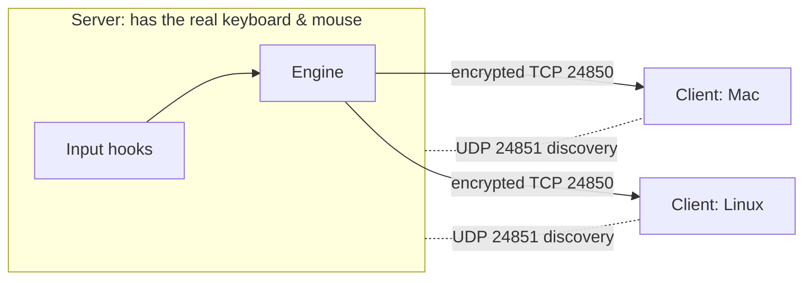
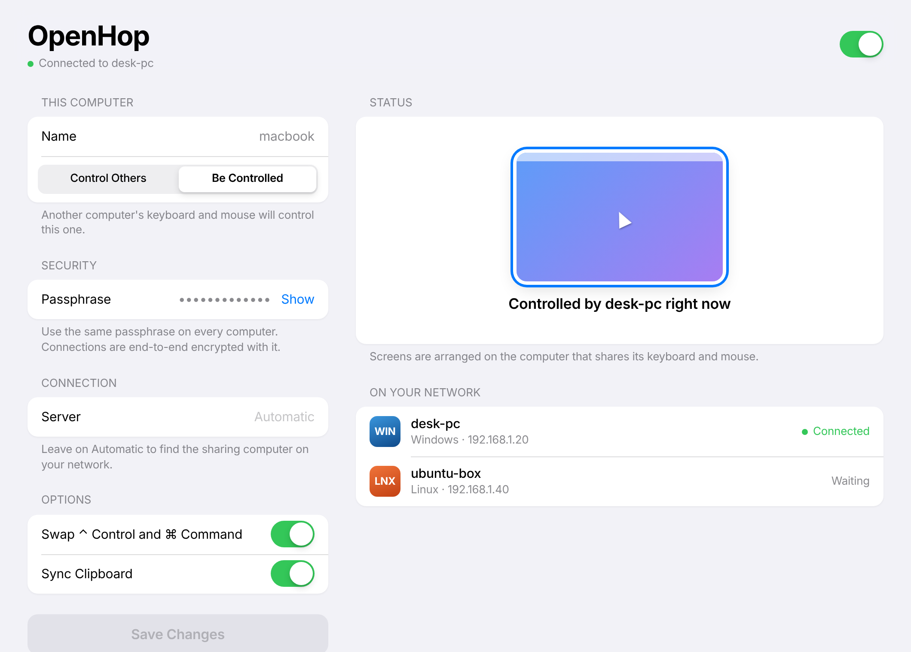

<div align="center">


# OpenHop

**One keyboard and mouse for all your computers.**
Free, open-source and encrypted. Works across Windows, macOS and Linux.

[](https://github.com/maykano-dev/open-hop/actions/workflows/build.yml)


</div>

<p align="center">
  
  
</p>

OpenHop is a **software KVM**. Put a few computers on your desk, run OpenHop on each of them, and move your mouse off the edge of one screen: the pointer appears on the next computer, and your keyboard follows it. Copy on one machine and paste on another. You don't need a hardware switch or any extra cables, only your local network.

It was built as a free, cross-platform alternative to paid tools such as CursorHop, Synergy or ShareMouse, with Linux supported as a first-class platform.

---

## Quick install

Run one command on each computer:

**Windows** (PowerShell):
```powershell
irm https://raw.githubusercontent.com/maykano-dev/open-hop/main/scripts/install.ps1 | iex
```

**macOS and Linux** (Terminal):
```bash
curl -fsSL https://raw.githubusercontent.com/maykano-dev/open-hop/main/scripts/install.sh | bash
```

The script downloads the latest release and installs it the native way for your system: the setup `.exe` on Windows, the `.dmg` app on macOS, and the `.deb` or `.rpm` package (or an AppImage) on Linux, including the input permissions Linux needs. If you'd rather click than type, download the installer directly:

| Your computer | Download from [Releases](https://github.com/maykano-dev/open-hop/releases/latest) |
|---|---|
| Windows 10 / 11 | `OpenHop_x.y.z_x64-setup.exe` (double-click to install) |
| macOS (Apple Silicon & Intel) | `OpenHop_x.y.z_universal.dmg` (drag to Applications) |
| Ubuntu / Debian / Mint | `OpenHop_x.y.z_amd64.deb` |
| Fedora / openSUSE | `OpenHop-x.y.z-1.x86_64.rpm` |
| Any other Linux | `OpenHop_x.y.z_amd64.AppImage` |

Then follow [Set up your computers](#set-up-your-computers).

## Contents

- [Quick install](#quick-install)
- [Features](#features)
- [How it works](#how-it-works)
- [Platform support](#platform-support)
- [Install](#install)
  - [Windows](#windows) · [macOS](#macos) · [Linux (Ubuntu, Debian, Fedora…)](#linux)
- [Set up your computers (5 minutes)](#set-up-your-computers)
- [Everyday use](#everyday-use)
- [Command line](#command-line)
- [Configuration file](#configuration-file)
- [Security](#security)
- [Troubleshooting](#troubleshooting)
- [Build from source](#build-from-source)
- [Project layout](#project-layout)
- [Roadmap](#roadmap)
- [License](#license)

---

## Features

| | |
|---|---|
| 🖱 **Mouse sharing** | Move the pointer off a screen edge and it hops to the next computer. No hotkeys or buttons needed. |
| ⌨️ **Keyboard sharing** | Your keyboard types on whichever computer has the pointer. Held keys are released when you leave a screen, so nothing gets stuck. |
| ⌘ **Shortcut translation** | When you cross between a Mac and a PC, `⌘ Command` and `Ctrl` are swapped automatically, so ⌘C on your Mac keyboard becomes Ctrl+C on Windows or Linux. |
| 📋 **Clipboard sync** | Copy text, an image or a screenshot on one computer and paste it on another. Images arrive pixel-perfect. |
| 🔒 **End-to-end encryption** | Every keystroke, mouse movement and clipboard item is encrypted with the [Noise protocol](https://noiseprotocol.org) (X25519, ChaCha20-Poly1305, BLAKE2s). There is no plaintext mode. |
| 📡 **Zero-config discovery** | Computers on the same network find each other automatically. You don't type any IP addresses. |
| 🗺 **Drag-and-drop arrangement** | Arrange screens the way they sit on your desk: left, right, above, below, or chained (A → B → C). |
| 🖥 **Multi-monitor aware** | Each computer's full desktop (all of its monitors) counts as one screen. |
| 🌗 **Native-feeling app** | An Apple-inspired settings window with light and dark mode. It keeps running in the system tray. |
| 🦀 **Fast Rust core** | Native input hooks and a lean protocol. A mouse move costs about 10 bytes on the wire. |
| 💻 **Headless CLI** | Run it on machines without a desktop session, or script it. |

## How it works

One computer is the **server**: it has the keyboard and mouse you actually use. Every other computer is a **client**.



1. The server watches its pointer. When it touches an edge that has a screen next to it in your arrangement, the server **captures** its local input. Your local pointer is hidden and parked, and your keystrokes and clicks stop reaching local apps.
2. Mouse motion, clicks, scrolling and key presses are sent to the active client, which **injects** them as if they came from a real device.
3. When the pointer leaves that client's screen, it lands on the next screen in the arrangement, which can be another client or back on the server.
4. Keys travel as standard USB HID codes, so a key pressed on any OS arrives as the same physical key on every other OS.

## Platform support

| | Share its keyboard & mouse (server) | Be controlled (client) |
|---|:---:|:---:|
| **Windows 10 / 11** | ✅ | ✅ |
| **macOS 11+** (Apple Silicon & Intel) | ✅ needs Accessibility permission | ✅ needs Accessibility permission |
| **Linux, X11 / Xorg session** | ✅ | ✅ |
| **Linux, Wayland session** (default on Ubuntu 22.04+) | ⚠️ not yet, see [roadmap](#roadmap) | ✅ via `uinput` (set up automatically by the .deb) |

**What works on Wayland.** A Wayland desktop can be *controlled* but can't yet *share* its own keyboard and mouse. The common setups work fine: a Windows PC or Mac as the server with Ubuntu as a client. If your Linux machine must be the server, log in with an Xorg session.

> **Test status (v0.1.0).** The Linux build is tested end to end: edge switching, keyboard, clicks, return trips, drag-to-arrange, text and image clipboard both ways (including full-size screenshots), wrong-passphrase rejection, auto-discovery, reconnecting, and installing via the `.deb` and the one-line installer. The Windows and macOS code compiles cleanly for those targets, and CI builds their installers, but it hasn't yet had hands-on testing on real hardware. Please [open an issue](https://github.com/maykano-dev/open-hop/issues) if something misbehaves.

---

## Install

The easiest way is the [one-line installer](#quick-install). To install by hand, download the installer for each computer from the repository's
**[Releases](https://github.com/maykano-dev/open-hop/releases)** page. Every push to `main` also builds installers: open the latest run under **[Actions → Build](https://github.com/maykano-dev/open-hop/actions/workflows/build.yml)** and download the `OpenHop-Windows`, `OpenHop-macOS` or `OpenHop-Linux` artifact.

### Windows

1. Run **`OpenHop_x.y.z_x64-setup.exe`** (or the `.msi`).
2. Windows SmartScreen may warn about an unrecognised app, because the builds aren't code-signed. Click **More info → Run anyway**.
3. When Windows Firewall asks, allow OpenHop on **Private networks**.
4. OpenHop opens and adds an icon to the system tray. Closing the window keeps it running; quit from the tray icon.

> To control windows that run **as Administrator** (Task Manager, installers), OpenHop must also run as Administrator. That's a Windows security rule that applies to every KVM app.

### macOS

1. Open **`OpenHop_x.y.z_universal.dmg`** and drag **OpenHop** into **Applications**.
2. The app isn't notarised yet, so open it the first time by right-clicking it and choosing **Open**, then **Open** again. If macOS says it is "damaged", run this once in Terminal:
   ```bash
   xattr -cr /Applications/OpenHop.app
   ```
3. **Grant permissions.** OpenHop needs to read and control the keyboard and mouse:
   - **System Settings → Privacy & Security → Accessibility** → turn on **OpenHop**
   - **System Settings → Privacy & Security → Input Monitoring** → turn on **OpenHop** (needed when the Mac shares its keyboard and mouse)
4. Quit and reopen OpenHop after granting them.
5. If macOS asks whether OpenHop may find devices on your local network, click **Allow**.

### Linux

**Ubuntu / Debian / Mint / Pop!_OS** (recommended):

```bash
sudo apt install ./OpenHop_0.1.0_amd64.deb
```

The package installs a udev rule and loads the `uinput` kernel module, so OpenHop can control your desktop on both X11 and Wayland. **Log out and back in once** after installing.

**Other distributions (AppImage):**

```bash
chmod +x OpenHop_0.1.0_amd64.AppImage
./OpenHop_0.1.0_amd64.AppImage
```

On Wayland, to be controlled from another computer, enable `uinput` once:

```bash
sudo modprobe uinput
echo uinput | sudo tee /etc/modules-load.d/openhop-uinput.conf
echo 'KERNEL=="uinput", SUBSYSTEM=="misc", GROUP="input", MODE="0660", OPTIONS+="static_node=uinput", TAG+="uaccess"' \
  | sudo tee /etc/udev/rules.d/60-openhop-uinput.rules
sudo udevadm control --reload-rules && sudo udevadm trigger --name-match=uinput
sudo usermod -aG input "$USER"    # then log out and back in
```

**Firewall** (if `ufw` is enabled):

```bash
sudo ufw allow 24850/tcp && sudo ufw allow 24851/udp
```

---

## Set up your computers

You'll need all computers on the **same network** (Wi-Fi or Ethernet, same router).

**1. Install OpenHop on every computer** (see [Install](#install)).

**2. On the computer whose keyboard and mouse you want to use:**
- Set **Role** to **Control Others**.
- Type a **passphrase**. Make it something long and memorable, like `purple-river-lamp-42`.
- Turn on the switch at the top right.

**3. On each of the other computers:**
- Set **Role** to **Be Controlled**.
- Enter the **same passphrase**.
- Turn on the switch. Within a few seconds it finds the server and shows **Connected to …**

<p align="center">
  
</p>

**4. Arrange your screens.** Back on the server, every connected computer appears under **Arrangement**. Drag each screen tile to where that computer physically sits relative to your main one, for example the MacBook to the right and the Ubuntu box to the left. The arrangement saves automatically.

**5. Hop!** Move your pointer off the edge of your screen toward another computer. A blue ring in the app shows which computer has the cursor.

---

## Everyday use

- **Moving between computers:** push the pointer through a shared edge. The entry point keeps the same relative height (or width), so going in halfway down comes out halfway down.
- **Keyboard:** typing always goes to the computer under the pointer.
- **Shortcuts across Mac ↔ PC:** with **Swap ⌃ Control and ⌘ Command** on (the default), use your keyboard's usual shortcut keys and they get translated for the target OS.
- **Copy & paste:** copy as usual on one computer, move over, and paste.
  - ✅ **Text**, including whole documents of up to 8 MB.
  - ✅ **Screenshots and images**: a screenshot taken to the clipboard (`Win+Shift+S`, `⌘⇧⌃4`, `PrtSc` on Linux) or an image copied from a browser or photo app. A full 2560×1440 screenshot arrives in about a second.
  - ❌ **Files and videos copied in Explorer / Finder / Files** aren't synced yet. The clipboard only holds a reference to the file, not the file itself. File transfer is next on the [roadmap](#roadmap).
- **Running in the background:** closing the window hides it to the tray or menu bar. Choose **Quit** from the tray icon to stop OpenHop completely.
- **Start automatically:** once a passphrase is saved, OpenHop starts sharing as soon as it launches. Add it to your OS's login items or startup apps to have it always on.
- **Something feels stuck?** Move the pointer back to the server. Leaving a screen always releases every key and mouse button that was held there. If a client disconnects, control returns to the server immediately.

---

## Command line

The `openhop` command-line tool runs the same engine without a window. It's useful for servers, scripting or troubleshooting.

```bash
# On the computer with the keyboard and mouse
openhop server --passphrase "purple-river-lamp-42" --name desk-pc

# On each controlled computer (auto-discovers the server)
openhop client --passphrase "purple-river-lamp-42" --name macbook

# ...or connect to a known address
openhop client --server 192.168.1.20 --passphrase "purple-river-lamp-42"

# Arrange screens: the server is at 0,0. 1,0 = right, -1,0 = left, 0,-1 = above, 0,1 = below
openhop place macbook 1 0
openhop place ubuntu-box -1 0

# See which OpenHop computers are on the network
openhop devices

# Show the config file location and contents (passphrase hidden)
openhop config
```

Add `--save` to any run command to store the given options in the config file. Set `RUST_LOG=debug` for detailed logs.

## Configuration file

Settings live in a TOML file, shared by the app and the CLI:

| OS | Location |
|---|---|
| Windows | `%APPDATA%\openhop\config.toml` |
| macOS | `~/Library/Application Support/openhop/config.toml` |
| Linux | `~/.config/openhop/config.toml` |

```toml
name = "desk-pc"             # name shown to other computers
role = "server"              # "server" or "client"
passphrase = "purple-river-lamp-42"
port = 24850                 # server TCP port
swap_cmd_ctrl = true         # translate Cmd <-> Ctrl between Mac and PC
clipboard_sync = true
linux_backend = "auto"       # Linux client: "auto", "x11" or "uinput"
# server_addr = "192.168.1.20"  # client: skip discovery
# server_name = "desk-pc"       # client: only join this server
# screen = { x = 0, y = 0, w = 2560, h = 1440 }  # override detected desktop size

[[layout.screens]]           # server: where each computer sits
name = "macbook"
x = 1
y = 0
```

---

## Security

- **Encrypted from the first byte.** Each connection runs a Noise `NNpsk2` handshake (X25519 key exchange, ChaCha20-Poly1305 encryption, BLAKE2s hashing). There is no unencrypted mode.
- **Passphrase-gated.** The pre-shared key is derived from your passphrase. A computer without it can't connect, and it can't read or inject anything.
- **No offline guessing.** The passphrase is mixed in *after* a fresh key exchange, so someone recording your network traffic can't brute-force it offline.
- **Local only.** OpenHop never talks to the internet. There's no account, telemetry or cloud relay.
- **Discovery beacons** broadcast only a computer name, OS and port. They contain nothing secret.

Use a passphrase of four or more words on networks you don't fully trust.

## Troubleshooting

<details>
<summary><b>The computers don't see each other</b></summary>

- Make sure they're on the same network. Guest Wi-Fi and "client isolation" often block device-to-device traffic.
- Allow OpenHop through the firewall: **TCP 24850** and **UDP 24851**.
- Some routers block broadcast discovery. On the client, enter the server's IP in **Server** (or use `--server 192.168.x.x`).
</details>

<details>
<summary><b>"Passphrase does not match"</b></summary>

The passphrases differ. They're case-sensitive, but leading and trailing spaces are ignored.
</details>

<details>
<summary><b>macOS: nothing happens, or "could not create event tap"</b></summary>

Grant **Accessibility** and **Input Monitoring** in System Settings → Privacy & Security, then quit and reopen OpenHop. After an update, macOS sometimes needs the permission toggled off and on again.
</details>

<details>
<summary><b>Linux: "cannot open /dev/uinput"</b></summary>

Follow the uinput steps under [Linux install](#linux), then log out and back in.
</details>

<details>
<summary><b>Linux: can't share the keyboard and mouse from Wayland</b></summary>

That isn't supported yet. Make that machine a client, or choose an **Xorg** session at the login screen (on Ubuntu, the gear icon after choosing your user).
</details>

<details>
<summary><b>Windows: can't click inside some windows</b></summary>

Those windows run as Administrator. Run OpenHop as Administrator too.
</details>

<details>
<summary><b>The pointer won't cross an edge</b></summary>

- Check the arrangement: there must be a screen in the cell next to that edge, and it must be connected (solid, not dashed).
- With several monitors, only the outer edges of the whole desktop are hop edges.
</details>

---

## Build from source

You'll need [Rust](https://rustup.rs) (stable) and [Node.js](https://nodejs.org) 18 or newer.

```bash
git clone https://github.com/maykano-dev/open-hop.git
cd open-hop

# Linux only: system libraries
sudo apt install libwebkit2gtk-4.1-dev libgtk-3-dev libayatana-appindicator3-dev librsvg2-dev libxdo-dev libssl-dev

cargo test -p openhop-core             # unit tests
cargo build --release -p openhop-cli   # CLI -> target/release/openhop

cd app && npm ci
npx tauri dev                          # run the desktop app
npx tauri build                        # build installers -> target/release/bundle/
```

On macOS, build a universal app with `rustup target add aarch64-apple-darwin x86_64-apple-darwin` and `npx tauri build --target universal-apple-darwin`.

**Releases:** push a tag such as `v0.2.0` (`git tag v0.2.0 && git push origin v0.2.0`). GitHub Actions builds every installer and publishes them as the latest release, which the one-line installers pick up automatically.

## Project layout

```
open-hop/
├── crates/
│   ├── core/                 # the engine (Rust library)
│   │   └── src/
│   │       ├── engine.rs     # server & client logic, edge switching
│   │       ├── layout.rs     # screen grid and edge maths
│   │       ├── net.rs        # Noise-encrypted framed transport
│   │       ├── discovery.rs  # UDP LAN discovery
│   │       ├── clipboard.rs  # clipboard watcher (text + PNG images)
│   │       ├── keys.rs       # HID <-> Windows / macOS / Linux key tables
│   │       ├── protocol.rs   # wire messages
│   │       └── platform/     # input capture & injection per OS
│   │           ├── windows.rs       # low-level hooks + SendInput
│   │           ├── macos.rs         # CGEventTap + CGEvent
│   │           ├── linux_x11.rs     # X11 grabs + XTEST
│   │           └── linux_uinput.rs  # virtual devices (Wayland)
│   └── cli/                  # `openhop` command-line tool
├── app/
│   ├── dist/                 # UI (HTML/CSS/JS, no build step)
│   └── src-tauri/            # Tauri desktop shell, tray, installers
├── scripts/                  # one-line installers (install.sh, install.ps1)
├── packaging/linux/          # udev rule + post-install script
├── docs/screenshots/
└── .github/workflows/        # CI: tests + installers for all three OSes
```

## Roadmap

- [ ] **File transfer**: copy/paste and drag-and-drop files and videos between computers
- [ ] **Wayland as server** via the XDG InputCapture portal (GNOME 45+, KDE 6+)
- [ ] **Hotkeys**: jump to a screen, or lock the pointer to the current one
- [ ] Per-monitor edges (cross from any monitor, not just the desktop's outer edge)
- [ ] Code-signed and notarised builds
- [ ] **Window streaming (phase 2):** drag an app window from one OS onto another
- [ ] Virtual-screen mode: show another computer's desktop as an extra monitor

Contributions and bug reports are welcome. Please open an issue first for larger changes.

## License

[MIT](LICENSE) © maykano-dev

OpenHop is an independent project. It's inspired by Synergy, Barrier, Deskflow and CursorHop, isn't affiliated with any of them, and doesn't use their code.
